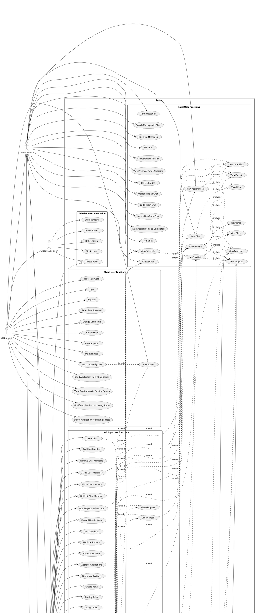

```plantuml
@startuml
left to right direction
skinparam packageStyle rectangle

actor "Global User" as globalUser
actor "Global Superuser" as globalSuperUser
actor "Local User" as localUser
actor "Local Superuser" as localSuperUser

rectangle System {
    
    globalUser <|-- globalSuperUser
    globalUser <|-- localUser
    localUser <|-- localSuperUser

    package "Global User Functions" {
        globalUser --> (Login)
        globalUser --> (Register)
        globalUser -> (Reset Password)
        globalUser --> (Reset Security Word)
        globalUser --> (Change Username)
        globalUser --> (Change Email)
        globalUser --> (Create Space)
        globalUser --> (View Space)
        globalUser --> (Delete Space)
        globalUser --> (Search Space by Link)
        (Search Space by Link) ..> (View Space) : include
        globalUser --> (Send Application to Existing Spaces)
        globalUser --> (View Applications to Existing Spaces)
        globalUser --> (Modify Application to Existing Spaces)
        globalUser --> (Delete Application to Existing Spaces)
    }

    package "Global Superuser Functions" {
        globalSuperUser --> (Delete Users)
        globalSuperUser --> (Block Users)
        globalSuperUser --> (Unblock Users)
        globalSuperUser --> (Delete Spaces)
        globalSuperUser --> (Delete Roles)
    }

    package "Local User Functions" {
        localUser --> (View Schedule)
        (View Schedule) ..> (View Events) : include
        (View Events) ..> (View Time) : include
        (View Events) ..> (View Subjects) : include
        (View Events) ..> (View Teachers) : include
        (View Events) ..> (View Place) : include
        localUser --> (View Teachers)
        localUser --> (View Subjects)
        localUser --> (View Assignments)
        (View Assignments) ..> (View Subjects) : include
        (View Assignments) ..> (View Files) : include
        localUser --> (Mark Assignments as Completed)
        localUser --> (Create Chat)
        (Create Event) ..> (View Teachers) : include
        (Create Event) ..> (View Subjects) : include
        (Create Event) ..> (View Time Slots) : include
        (Create Event) ..> (View Places) : include
        localUser --> (Join Chat)
        localUser --> (View Chat)
        (View Chat) ..> (View Files) : include
        localUser --> (Send Messages)
        localUser --> (Search Messages in Chat)
        localUser --> (Edit Own Messages)
        localUser --> (Exit Chat)
        localUser --> (Create Grades for Self)
        localUser --> (View Personal Grade Statistics)
        localUser --> (Delete Grades)
        localUser --> (Upload Files to Chat)
        localUser --> (Edit Files in Chat)
        localUser --> (Delete Files from Chat)
    }

    package "Local Superuser Functions" {
        localSuperUser --> (Modify Space Information)
        (Modify Space Information) ..> (View Space) : extend
        localSuperUser --> (View All Files in Space)
        localSuperUser --> (Block Students)
        localSuperUser --> (Unblock Students)
        localSuperUser --> (View Applications)
        localSuperUser --> (Approve Applications)
        localSuperUser --> (Delete Applications)
        localSuperUser --> (Create Roles)
        localSuperUser --> (Modify Roles)
        localSuperUser --> (Delete Roles)
        localSuperUser --> (Assign Roles)
        localSuperUser --> (Revoke Roles)
        localSuperUser --> (Set Local Permissions Restrictions)
        localSuperUser --> (Remove Local Permissions Restrictions)
        localSuperUser --> (Create Assignment)
        localSuperUser --> (Modify Assignment)
        (Modify Assignment) ..> (View Assignments) : extend
        localSuperUser --> (Delete Assignment)
        (Delete Assignment) ..> (View Assignments) : extend
        localSuperUser --> (Upload Files to Assignments)
        localSuperUser --> (Modify Files in Assignments)
        localSuperUser --> (Delete Files from Assignments)
        localSuperUser --> (Create Schedule)
        (Create Schedule) ..> (Create Week) : include
        (Create Week) ..> (Create Event) : include
        localSuperUser --> (Modify Schedule)
        (Modify Schedule) ..> (View Schedule) : extend
        localSuperUser --> (Delete Schedule)
        (Delete Schedule) ..> (View Schedule) : extend
        localSuperUser --> (Create Week)
        localSuperUser --> (Modify Week)
        (Modify Week) ..> (View Schedule) : extend
        localSuperUser --> (Delete Week)
        (Delete Week) ..> (View Schedule) : extend
        localSuperUser --> (Create Event)
        localSuperUser --> (Modify Event)
        (Modify Event) ..> (View Events) : extend
        localSuperUser --> (Delete Event)
        (Delete Event) ..> (View Events) : extend
        localSuperUser --> (Create Teachers)
        localSuperUser --> (Modify Teacher)
        (Modify Teacher) ..> (View Teachers) : extend
        localSuperUser --> (Delete Teacher)
        (Delete Teacher) ..> (View Teachers) : extend
        localSuperUser --> (Create Subjects)
        localSuperUser --> (Modify Subject)
        (Modify Subject) ..> (View Subjects) : extend
        localSuperUser --> (Delete Subject)
        (Delete Subject) ..> (View Subjects) : extend
        localSuperUser --> (Create Time Slots)
        localSuperUser --> (Modify Time Slot)
        (Modify Time Slot) ..> (View Time Slots) : extend
        localSuperUser --> (Delete Time Slot)
        (Delete Time Slot) ..> (View Time Slots) : extend
        localSuperUser --> (Create Place)
        localSuperUser --> (Modify Place)
        (Modify Place) ..> (View Places) : extend
        localSuperUser --> (Delete Place)
        (Delete Place) ..> (View Places) : extend
        localSuperUser --> (Create Geopair)
        localSuperUser --> (Modify Geopair)
        (Modify Geopair) ..> (View Geopairs) : extend
        localSuperUser --> (Delete Geopair)
        (Delete Geopair) ..> (View Geopairs) : extend
        localSuperUser --> (Create Chat)
        localSuperUser --> (Modify Chat)
        (Modify Chat) ..> (View Chat) : extend
        localSuperUser --> (Delete Chat)
        (Delete Chat) ..> (View Chat) : extend
        localSuperUser --> (Add Chat Member)
        localSuperUser --> (Remove Chat Members)
        localSuperUser --> (Delete User Messages)
        (Delete User Messages) ..> (View Chat) : extend
        localSuperUser --> (Block Chat Members)
        localSuperUser --> (Unblock Chat Members)
    }
}
@enduml
```

