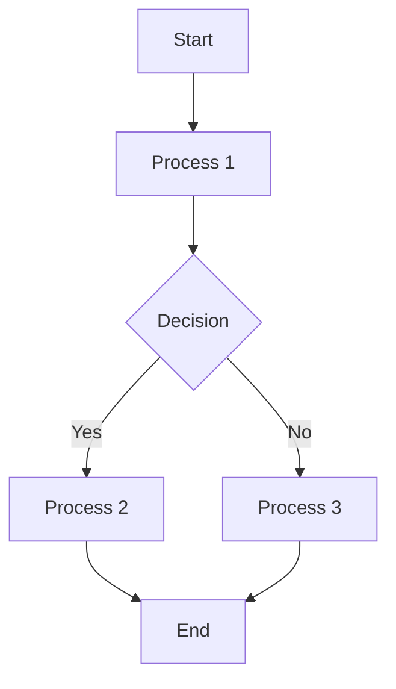

```mehrmaid
flowchart LR
A --> C
B --> D
C & D --> E
E --> F & G
F --> H
G --> J
subgraph X ["$X$"]
A(("$A$"))
end
subgraph id1 ["$Y$"]
G(("$G$"))
end
subgraph id3 ["$Z$"]
E(("$E$"))
end
C(("$C$"))
D(("$D$"))
F(("$F$"))
B(("$B$"))
H(("$H$"))
J(("$J$"))
```


```mehrmaid
flowchart LR
A --> C
B --> D
C & D --> E
E --> F & G
F --> H
G --> J
subgraph X ["$X$"]
A(("$A$"))
end
subgraph id1 ["$Y$"]
G(("$G$"))
end
subgraph id3 ["$Z$"]
E(("$E$"))
end
C(("$C$"))
D(("$D$"))
F(("$F$"))
B(("$B$"))
H(("$H$"))
J(("$J$"))
```


