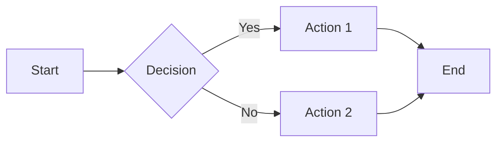

```mermaid
graph LR
    A[Start] --> B{Decision}
    B -- Yes --> C[Action 1]
    B -- No --> D[Action 2]
    C --> E[End]
    D --> E
```
---

```mermaid
graph LR
    A[Start] --> B{Decision}
    B -- Yes --> C[Action 1]
    B -- No --> D[Action 2]
    C --> E[End]
    D --> E
```
---

```mermaid
graph LR
    A[Start] --> B{Decision}
    B -- Yes --> C[Action 1]
    B -- No --> D[Action 2]
    C --> E[End]
    D --> E
```
