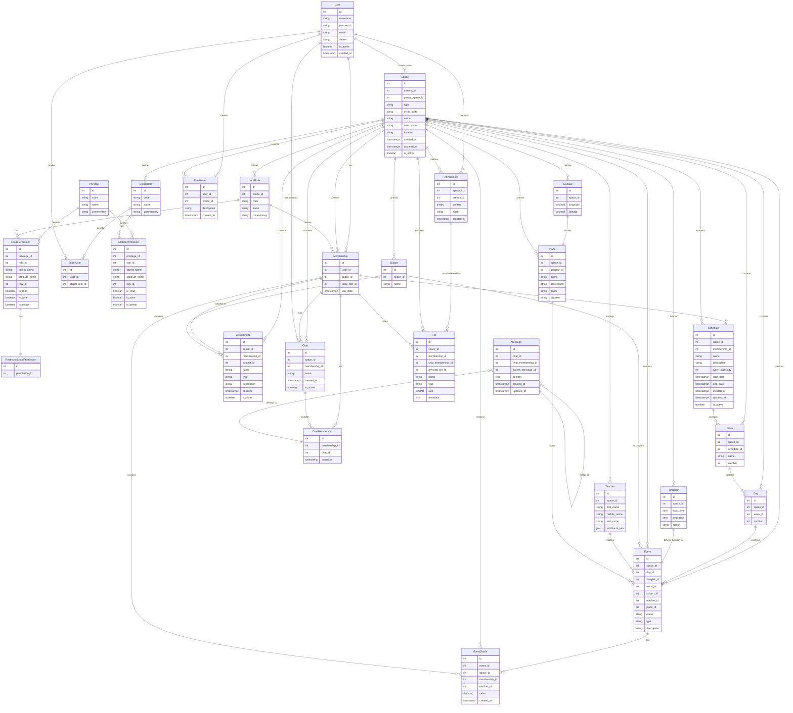

```mermaid
erDiagram
    User ||--o{ Membership : "has"
    Space ||--o{ Membership : "contains"
    User ||--o{ Space : "create space"
    
    GlobalRole ||--o{ SuperUser : "defines"
    LocalRole ||--o{ Membership : "defines"
    Privilege ||--o{ GlobalPermission : "defines"
    Privilege ||--o{ LocalPermission : "defines"
    GlobalRole ||--o{ GlobalPermission : "has"
    LocalRole ||--o{ LocalPermission : "has"

    LocalPermission ||--|| RestrictedLocalPermission : "has"

    User ||--o{ Enrollment : "creates"
    Space ||--o{ Enrollment : "receives"

    Membership ||--o{ Schedule : "has"
    Space ||--o{ Schedule : "contains"
    
    Space ||--o{ Week : "contains"
    Schedule ||--o{ Week : "contains"
    Space ||--o{ Day : "contains"
    Week ||--o{ Day : "contains"
    Space ||--o{ Event : "contains"
    Day ||--o{ Event : "contains"
    Timepair ||--|| Event : "defines duration for"
    
    Space ||--o{ Event : "contains"
    Subject ||--o{ Event : "is taught in"
    Teacher ||--o{ Event : "teaches"
    Place ||--o{ Event : "hosts"
    Geopair ||--|| Place : "locates"
    
    Event ||--o{ EventGrade : "has"
    Space ||--o{ EventGrade : "contains"
    Membership ||--o{ EventGrade : "receives"
    
    Space ||--o{ Assignment : "contains"
    Membership ||--o{ Assignment : "contains"
    Subject ||--o{ Assignment : "belongs to"

    Space ||--o{ Chat : "contains"
    Membership ||--o{ Chat : "has"
    User ||--o{ Chat : "create chats"
        
    Membership ||--o{ ChatMembership : "has"
    Chat ||--o{ ChatMembership : "includes"
    Message }o--|| ChatMembership : "belongs to"
    Message }o--|| Message : "replies to"
    
    User ||--o{ PhysicalFile : "creates"
    Space ||--o{ PhysicalFile : "contains"
    PhysicalFile ||--o{ File : "is represented by"
    Space ||--o{ File : "contains"
    Membership ||--o{ File : "owns"

    Space ||--o{ GlobalRole : "defines"
    Space ||--o{ LocalRole : "defines"
    Space ||--o{ Timepair : "defines"
    Space ||--o{ Subject : "contains"
    Space ||--o{ Teacher : "employs"
    Space ||--o{ Geopair : "defines"
    Space ||--o{ Place : "contains"
    
    User ||--o{ SuperUser : "can be"

    User {
        int id
        string username
        string password
        string email
        string secret 
        boolean is_active
        timestamp created_at
    }

    Privilege {
        int id 
        string code 
        string name
        string commentary
    }

    GlobalRole {
        int id
        string code
        string name
        string commentary
    }

    LocalRole {
        int id
        int space_id
        string code
        string name
        string commentary
    }
    

    GlobalPermission {
        int id 
        int privilege_id
        int role_id
        string object_name
        string attribute_name
        int row_id
        boolean is_read 
        boolean is_write 
        boolean is_delete
    }

    LocalPermission {
        int id 
        int privilege_id
        int role_id
        string object_name
        string attribute_name
        int row_id
        boolean is_read 
        boolean is_write 
        boolean is_delete
    }

    RestrictedLocalPermission {
        int id 
        int permission_id
    }

    SuperUser {
        int id 
        int user_id
        int global_role_id
    }
    
    Space {
        int id
        int creator_id
        int parent_space_id
        string type
        string invite_code
        string name
        string description
        string location
        timestampz created_at
        timestampz updated_at
        boolean is_active
    }

    Membership {
        int id 
        int user_id
        int space_id
        int local_role_id
        timestampz join_date
    }

    Enrollment {
        int id 
        int user_id
        int space_id
        string description
        timestampz created_at
    }
    
    Schedule {
        int id
        int space_id 
        int membership_id
        string name
        string description
        int week_start_day
        timestampz start_date
        timestampz end_date
        timestampz created_at
        timestampz updated_at
        boolean is_active
    }

    Week {
        int id
        int space_id
        int schedule_id
        string name
        int number
    }

    Day {
        int id
        int space_id
        int week_id
        int number
    }

    Event {
        int id
        int space_id
        int day_id
        int timepair_id
        int event_id
        int subject_id
        int teacher_id
        int place_id
        string name
        string type
        string description
    }
    
    Timepair {
        int id 
        int space_id
        time start_time 
        time end_time 
        string name
    }

    Subject {
        int id
        int space_id
        string name
    }

    Teacher {
        int id
        int space_id
        string first_name
        string middle_name
        string last_name
        json additional_info
    }

    Geopair {
        int id
        int space_id
        decimal longitude 
        decimal latitude
    }

    Place {
        int id  
        int space_id
        int geopair_id
        string name
        string description
        string room
        string address
    }

    EventGrade {
        int id
        int event_id
        int space_id
        int membership_id
        int teacher_id
        decimal value
        timestamp created_at
    }

    Assignment {
        int id
        int space_id
        int membership_id
        int subject_id
        string name 
        string type  
        string description
        timestampz deadline
        boolean is_done
    }

    Chat {
        int id
        int space_id
        int membership_id
        string name
        timestampz created_at
        boolean is_active
    }

    ChatMembership {
        int id
        int membership_id
        int chat_id
        timestamp joined_at
    }

    Message {
        int id
        int chat_id
        int chat_membership_id
        int parent_message_id
        text content
        timestampz created_at
        timestampz updated_at
    }

    PhysicalFile {
        int id
        int space_id
        int creator_id
        binary content
        string hash
        timestamp created_at
    }

    File {
        int id
        int space_id
        int membership_id
        int chat_membership_id
        int physical_file_id 
        string name
        string type
        BIGINT size
        json metadata
    }
```

